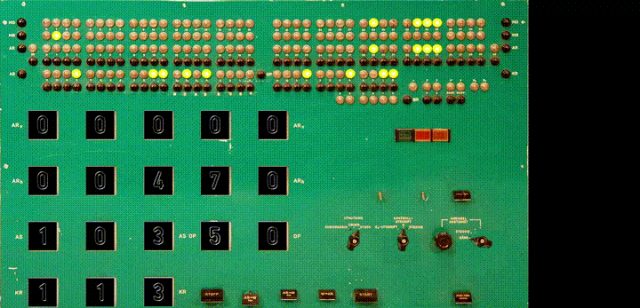

# BESK - Binär Elektronisk SekvensKalkylator

This project emulate, simulate and replicate the BESK computer.
BESK was Sweden's first electronic computer. It was ready for use around 1953
using more than 2000 vacuum tubes. A 5-channel paper tape reader/puncher 
and an electrical type writer was used for input and output. 
There where also two cathode ray tubes for function display, one of the 
tubes was used together with a camera to take snapshots of the drawings.

